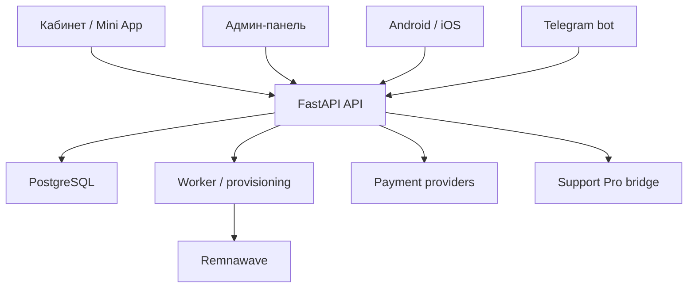

# Карта проекта Shop by Boo

Документ описывает актуальную структуру репозитория `v21.5.1` и границы компонентов. Карта не объявляет внешние платёжные, SMTP, VPN или mobile-signing проверки пройденными.

## Архитектура

## Каталоги

| Путь | Назначение | Вход для изменений |
| --- | --- | --- |
| `backend/app` | API, авторизация, платежи, подписки, support, админские операции | Добавляйте отдельный router/module; не расширяйте монолит без теста |
| `backend/alembic/versions` | Миграции PostgreSQL/SQLite | Только вперёд; downgrade финансовых миграций запрещён |
| `admin/src` | Админская SPA-панель | `main.tsx` — загрузка, feature-компоненты — отдельные файлы |
| `cabinet/src` | Клиентский кабинет и Mini App surface | Общие workspace-компоненты, API с cookie/CSRF |
| `miniapp/src` | Оболочка кабинета Telegram Mini App | Не дублировать бизнес-логику из `cabinet` |
| `mobile` | Android/iOS пользовательские и admin-клиенты | Подпись и публикация требуют ключей владельца |
| `desktop` | Контракты нативного WireGuard shell | Нативный engine не симулируется веб-кодом |
| `support-pro` | Изолированный сервис поддержки | SSO/bridge, отдельная миграция и backup |
| `docs` | Инструкции, матрица покрытия и архивы | Текущие документы должны ссылаться на release contract |
| `scripts` | Test/release/update/diagnostic automation | Скрипты не должны принимать секреты из URL |

## Функциональная карта

| Контур | Реализация | Основные файлы | Доказательство |
| --- | --- | --- | --- |
| Идентичности и безопасность | Telegram, email/password, OAuth, CSRF, sessions, TOTP, browser passkeys | `main.py`, `security.py`, `passkeys.py`, `customer_passkeys.py` | backend regression + HTTPS E2E |
| Коммерция | Plans, constructor, proration, traffic packages, gifts, wallet | `subscription_commerce.py`, `subscriptions.py`, `gift_orders.py` | unit/integration + provider E2E |
| Платежи | YooKassa, Platega, RollyPay, sandbox, refunds, reconciliation | `payments.py`, `payment_policy.py`, `refund_accounting.py` | application E2E v2 |
| Provisioning | Retry queue, absolute entitlements, Remnawave mapping | `provisioner.py`, `remnawave.py`, `subscriptions.py` | isolated VPN stand |
| Referrals/partners | Levels, snapshots, commissions, withdrawals | `referral_program.py`, `partners.py` | ledger/retry tests |
| Content/menus | Pages, legal revisions, promo audiences, nested bot/Mini App tree | `content_publishing.py`, `menu_tree.py`, `personal_offers.py` | UI E2E + publish preview |
| Support | Threads, attachments, merge/split, Support Pro mapping | `support_threads.py`, `support_bridge.py`, `support_topology.py` | replay/import/attachment tests |
| Operations | Backups, monitoring, audit, releases, bulk actions | `production_api.py`, `admin_customer_operations.py` | CI + clean restore drill |
| Native | Mobile auth/catalog/subscription selection and desktop contracts | `mobile_api.py`, `mobile_catalog.py`, `mobile/*`, `desktop/*` | owner-signed builds |

## Карта данных

- `User` — identity, wallet, referral and lifecycle.
- `Plan`, `TariffConstructor`, `TrafficPackage` — commercial catalogue.
- `Payment`, `FinancialLedger`, `RefundRequest` — immutable financial trail.
- `Subscription`, `EntitlementQuote`, `EntitlementOperation` — entitlement changes/retries.
- `SupportTicket`, `SupportMessage`, `SupportAttachment` — ordered support thread.
- `AuditLog`, `SecurityIncident`, `Notification` — operator evidence.
- `BackupJob`, `BackupVerification`, `ReleaseRecord` — operational lifecycle.

## Дизайн-карта

Веб-интерфейсы используют единый Aurora-визуальный слой:

- navy-фон с violet/blue/mint accents;
- glass surfaces только на крупных контейнерах;
- состояние показывается цветом и текстом, а не только цветом;
- `focus-visible` сохраняется для клавиатуры;
- sidebar превращается в drawer на узких экранах;
- таблицы прокручиваются горизонтально без обрезки действий;
- reduced-motion отключает декоративные переходы.

Дизайн реализован без дублирования бизнес-логики: `admin/src/design-refresh.css` и слой в `cabinet/src/style.css` меняют визуальные токены, а не API-контракты.

## Рабочий цикл изменения

1. Найдите контур в этой карте и профильной инструкции.
2. Проверьте API/модель/миграцию; не создавайте второй источник истины.
3. Добавьте негативный тест: replay, wrong owner, stale fingerprint, conflict или rollback.
4. Проверьте `git diff --check`, backend tests и typecheck/build соответствующего интерфейса.
5. Обновите карту, README и release notes только по фактическому поведению.
